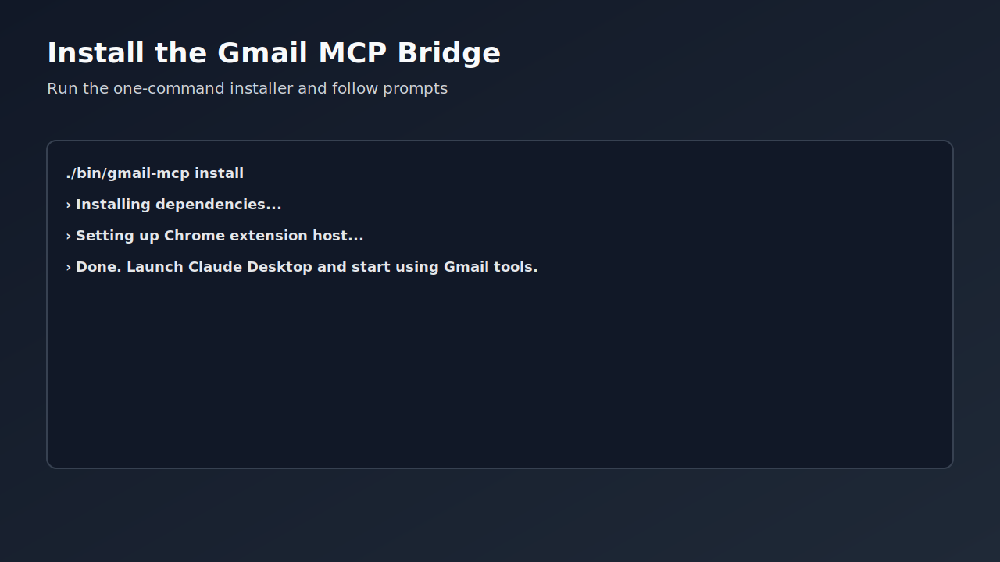
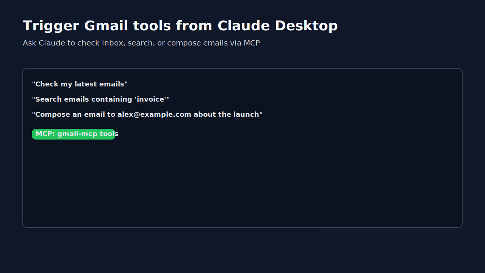
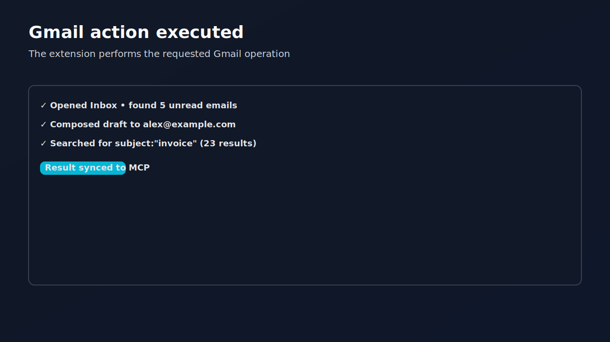

# Gmail MCP Bridge

English | [中文文档 README.zh-CN.md](./README.zh-CN.md)

> Control Gmail from Claude Desktop via a Chrome Extension + Model Context Protocol (MCP). No API keys. Free.

[](https://opensource.org/licenses/MIT)
[](https://developer.chrome.com/docs/extensions/)
[](https://modelcontextprotocol.io/)
[](https://github.com/cafferychen777/gmail-mcp)

[](https://cafferychen777.github.io/gmail-mcp/)
[](https://github.com/cafferychen777/gmail-mcp/releases)
[](CONTRIBUTING.md)
[](https://github.com/cafferychen777/gmail-mcp/discussions)
[](https://github.com/cafferychen777/gmail-mcp/actions/workflows/codeql.yml)
[](https://github.com/cafferychen777/gmail-mcp/graphs/contributors)
[](https://github.com/cafferychen777/gmail-mcp/labels/good-first-issue)
[](https://github.com/cafferychen777/gmail-mcp/issues)
[](https://github.com/cafferychen777/gmail-mcp/pulls)

Enable Gmail automation for AI assistants through a Chrome extension and the Model Context Protocol. Works locally, respects your browser session, and requires no Google API keys.

If this project helps you, please ⭐ star the repo and join the [Discussions](https://github.com/cafferychen777/gmail-mcp/discussions).

## ⚡ Installation

For a guided setup, see the Quick Start and Website:
- Quick Start: [docs/quick-start/installation.md](./docs/quick-start/installation.md)
- Website: https://cafferychen777.github.io/gmail-mcp/

Prerequisites:
- Node.js 18+
- Google Chrome (latest)
- Claude Desktop (with MCP enabled)

```bash
# One-command install (recommended)
./bin/gmail-mcp install

# Or manual setup
cd gmail-mcp-extension/mcp-server && npm install
```

## 📁 Project Structure

```
gmail-mcp/
├── bin/                     # CLI utilities (installer/manager)
│   └── gmail-mcp
├── gmail-mcp-extension/     # Chrome Extension + MCP bridge server
│   ├── extension/           # Chrome extension source
│   ├── mcp-server/          # MCP bridge server
│   └── src/                 # Core logic and recovery system
├── docs/                    # Documentation
│   ├── planning/
│   ├── reports/
│   └── analysis/
├── scripts/                 # Tooling scripts
│   ├── test/
│   └── util/
├── src/                     # Advanced features
│   ├── core/
│   └── plugins/
├── tests/
├── tools/
└── Key docs
    ├── README.md
    ├── README.zh-CN.md
    ├── CLAUDE.md
    ├── CONTRIBUTING.md
    └── RELEASE.md
```

## 🚀 Features

- Gmail read/search/send/reply
- Full Gmail search syntax support
- Multi-account switching
- Auto-recovery (95%+ common failures)
- Self-diagnosis and repair utilities
- Low-latency, high-throughput local bridge

## 🎯 Usage

### CLI management

```bash
gmail-mcp status    # Check system status
gmail-mcp doctor    # Diagnose issues
gmail-mcp fix       # Auto-fix common problems
gmail-mcp test      # Run tests
```

### In Claude Desktop

After installation, just ask Claude:
- "Check my latest emails"
- "Send an email to john@example.com"
- "Search emails containing 'project'"

## 📚 Documentation

- Developer architecture: [docs/developer/architecture.md](docs/developer/architecture.md)
- Roadmap: [docs/planning/COMPREHENSIVE_IMPROVEMENT_ROADMAP.md](docs/planning/COMPREHENSIVE_IMPROVEMENT_ROADMAP.md)
- Contribution guide: [CONTRIBUTING.md](CONTRIBUTING.md)

## 🎬 Demo / Screenshots

Below are placeholder screenshots; a short demo GIF will be added soon.







Planned: `docs/assets/screenshots/demo.gif` (≤10s).

If you'd like to help, check the good first issues.

## 🏆 Why this project

- No API keys, works directly with your browser session
- Fast local bridge with MCP for AI assistants
- Production-ready structure with installer and diagnostics

## 🔗 Social preview (Open Graph)

Improve link previews when sharing the repo by uploading a social image:

1. Use the placeholder at `docs/assets/images/og-preview.svg` (export to 1200×630 PNG if needed)
2. Go to GitHub → Repository Settings → General → Social preview → Upload the image

## 🤝 Contributing

PRs welcome! Please read [CONTRIBUTING.md](CONTRIBUTING.md).

## 📄 License

MIT License — see [LICENSE](LICENSE)

---

Gmail MCP Bridge — Control Gmail from Claude Desktop via MCP 🚀

## 🧭 Community & Support

- Code of Conduct: [CODE_OF_CONDUCT.md](CODE_OF_CONDUCT.md)
- Security policy: [SECURITY.md](SECURITY.md)
- Support: [SUPPORT.md](SUPPORT.md)
- Discussions: https://github.com/cafferychen777/gmail-mcp/discussions
- Good first issues: https://github.com/cafferychen777/gmail-mcp/labels/good-first-issue
- Help wanted: https://github.com/cafferychen777/gmail-mcp/labels/help-wanted