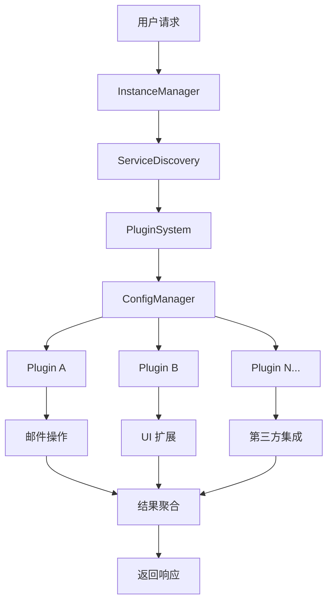

# Gmail MCP Bridge 模块 F：健壮性增强和插件化架构

## 🎯 概述

模块 F 实现了 Gmail MCP Bridge 的健壮性增强和插件化架构，基于 Linus Torvalds 的"好品味"设计原则：

1. **消除特殊情况** - 统一的插件加载机制、配置管理、服务发现
2. **数据结构优先** - 用配置驱动行为，避免硬编码逻辑
3. **Never break userspace** - 向后兼容，插件系统不影响核心功能
4. **实用主义** - 解决真实的扩展需求和多实例问题

## 🏗️ 架构设计

### 核心组件

```
src/
├── core/                           # 核心系统
│   ├── service-discovery.js        # 服务发现和负载均衡
│   ├── instance-manager.js         # 多实例管理
│   ├── config-manager.js           # 配置管理
│   └── plugin-system.js            # 插件系统核心
├── plugins/                        # 插件生态
│   ├── plugin-interface.js         # 标准插件接口
│   ├── registry.js                 # 插件注册表
│   └── examples/                   # 示例插件
│       ├── outlook-plugin.js       # Outlook 支持插件
│       └── custom-theme.js         # 自定义主题插件
└── integration-example.js          # 集成使用示例
```

### 数据流架构



## 🔧 核心功能

### 1. 服务发现和负载均衡 (service-discovery.js)

**核心理念**：消除特殊情况，所有服务用同一套发现和管理机制

```javascript
import { ServiceDiscovery } from './core/service-discovery.js';

const serviceDiscovery = new ServiceDiscovery({
  healthCheckInterval: 5000,
  serviceTimeout: 10000
});

// 注册服务
await serviceDiscovery.registerService('gmail-mcp-server', {
  host: 'localhost',
  port: 3456,
  protocol: 'http',
  healthCheck: { path: '/health' },
  loadBalance: { algorithm: 'round-robin' }
});

// 自动发现服务
await serviceDiscovery.discoverServices();

// 获取健康服务实例（自动负载均衡）
const service = await serviceDiscovery.getHealthyService('gmail-mcp-server');
```

**负载均衡算法支持**：
- `round-robin` - 轮询
- `weighted` - 权重分配
- `least-connections` - 最少连接
- `response-time` - 响应时间优先

### 2. 多实例管理 (instance-manager.js)

**核心理念**：实用主义解决真实的多窗口、多用户问题

```javascript
import { InstanceManager } from './core/instance-manager.js';

const instanceManager = new InstanceManager({
  maxInstances: 10,
  conflictResolution: 'collaborative'  // 协作模式
});

await instanceManager.start();

// 自动检测现有实例
await instanceManager.discoverExistingInstances();

// 冲突解决策略
const strategies = [
  'first-wins',      // 先到先得
  'priority-based',  // 优先级策略  
  'collaborative',   // 协作策略
  'user-choice'      // 用户选择
];
```

**支持的实例类型**：
- Chrome 窗口实例
- Claude Desktop 实例  
- MCP 服务器实例

### 3. 配置管理 (config-manager.js)

**核心理念**：Never break userspace，配置变更向后兼容

```javascript
import { ConfigurationManager } from './core/config-manager.js';

const configManager = new ConfigurationManager({
  environment: 'production',
  hotReload: true,
  autoMigration: true
});

// 生成配置（基于模板）
const config = await configManager.generateConfig(
  'claude-config.json',
  'claude-desktop',
  {
    serverPath: './mcp-server/index.js',
    environment: 'production'
  }
);

// 安全的配置更新（自动备份和回滚）
await configManager.updateConfig('claude-config.json', (config) => ({
  ...config,
  newFeature: { enabled: true }
}));

// 环境切换
await configManager.switchEnvironment('development');

// 自动配置迁移
await configManager.migrateConfig('app-config.json', '2.0.0');
```

**支持的配置模板**：
- Claude Desktop 配置
- MCP 服务器配置
- Chrome 扩展配置

### 4. 插件系统 (plugin-system.js)

**核心理念**：数据结构优先的插件生命周期管理

```javascript
import { PluginSystem } from './core/plugin-system.js';

const pluginSystem = new PluginSystem({
  pluginDirectory: './plugins',
  autoLoad: true,
  sandboxMode: true  // 安全沙箱
});

await pluginSystem.initialize();

// 加载插件
await pluginSystem.loadPlugin('./plugins/outlook-plugin');

// 激活插件
await pluginSystem.activatePlugin('outlook-plugin');

// 钩子系统
pluginSystem.registerHook('email-received', async (context) => {
  // 处理邮件接收事件
  return context;
});

// 触发钩子
await pluginSystem.triggerHook('email-received', { email: emailData });
```

**插件生命周期**：
1. **加载** (Loading) - 读取插件文件和元数据
2. **验证** (Validation) - 检查依赖和权限
3. **初始化** (Initialization) - 执行插件初始化
4. **激活** (Activation) - 插件开始工作
5. **停用** (Deactivation) - 暂停插件功能
6. **卸载** (Unloading) - 清理插件资源

## 📦 插件开发

### 标准插件接口

```javascript
import { EmailHandlerPlugin } from '../plugins/plugin-interface.js';

export default class MyEmailPlugin extends EmailHandlerPlugin {
  constructor(options) {
    super(options);
    
    this.name = 'my-email-plugin';
    this.version = '1.0.0';
    this.description = 'My custom email handler';
    this.permissions = ['email-read', 'email-write'];
  }

  async onInitialize() {
    // 插件初始化逻辑
  }

  async handleEmailAction(action, params) {
    switch (action) {
      case 'send':
        return await this.sendEmail(params);
      case 'read':
        return await this.readEmail(params);
      default:
        throw new Error(`Unsupported action: ${action}`);
    }
  }
}
```

### 插件类型

1. **邮件处理插件** (`EmailHandlerPlugin`)
   - 扩展邮件服务支持（Outlook、Yahoo等）
   - 自定义邮件处理逻辑

2. **UI 扩展插件** (`UIExtensionPlugin`)  
   - 自定义界面组件
   - 交互功能扩展

3. **主题插件** (`ThemePlugin`)
   - 自定义主题和样式
   - 界面个性化

### 插件注册表和市场

```javascript
import { PluginRegistry } from './plugins/registry.js';

const registry = new PluginRegistry({
  officialRegistry: 'https://registry.gmail-mcp.com',
  autoUpdate: true
});

// 搜索插件
const results = await registry.searchPlugins('outlook', {
  category: 'email-providers'
});

// 安装插件
await registry.installPlugin('outlook-plugin');

// 更新插件
await registry.updatePlugin('outlook-plugin');
```

## 🚀 使用示例

### 基本集成

```javascript
import GmailMCPBridgeV2 from './src/integration-example.js';

const bridge = new GmailMCPBridgeV2({
  environment: 'production'
});

// 初始化并启动
await bridge.initialize();
await bridge.start();

// 处理邮件操作（自动路由到合适的插件）
const result = await bridge.handleEmailAction('send', {
  to: 'example@gmail.com',
  subject: 'Test Email',
  body: 'Hello from Gmail MCP Bridge v2!'
}, 'gmail');
```

### 高级配置

```javascript
const bridge = new GmailMCPBridgeV2({
  environment: 'production',
  
  // 服务发现配置
  services: {
    healthCheckInterval: 5000,
    loadBalancing: 'response-time'
  },
  
  // 实例管理配置
  instances: {
    conflictResolution: 'collaborative',
    maxInstances: 20
  },
  
  // 插件系统配置
  plugins: {
    sandboxMode: true,
    autoLoad: true,
    allowThirdParty: false  // 仅加载官方插件
  }
});
```

## 🔐 安全和权限

### 插件沙箱

- **权限系统** - 插件需要声明和请求权限
- **API 访问控制** - 限制插件可调用的系统 API
- **资源隔离** - 插件间相互隔离，防止干扰

### 安全扫描

```javascript
// 自动安全扫描
const scanResult = await pluginRegistry.performSecurityScan(plugin);

if (scanResult.level === 'dangerous') {
  throw new Error(`Security risk detected: ${scanResult.reason}`);
}
```

## 📈 性能优化

### 智能缓存

- **连接池管理** - 复用网络连接，减少开销
- **配置缓存** - 热数据内存缓存，TTL 动态调整
- **服务发现缓存** - 避免重复的服务检测

### 负载均衡

- **健康检查** - 自动检测服务状态
- **故障转移** - 自动切换到健康实例
- **性能监控** - 响应时间统计和优化

## 🔍 监控和调试

### 系统状态监控

```javascript
// 获取系统健康状态
const status = bridge.getSystemStatus();

console.log('Services:', status.services);
console.log('Instances:', status.instances); 
console.log('Plugins:', status.plugins);
console.log('Registry:', status.registry);
```

### 调试工具

```bash
# 运行完整演示
node src/integration-example.js

# 检查插件状态
npx @modelcontextprotocol/inspector src/plugins/examples/outlook-plugin.js
```

## 🎯 设计原则实践

### 1. 消除特殊情况

- **统一接口** - 所有插件使用相同的生命周期管理
- **一致性处理** - 错误处理、配置管理用相同的模式
- **标准化** - 服务注册、发现、负载均衡使用统一机制

### 2. 数据结构优先

```javascript
// 用配置驱动行为，而非硬编码逻辑
const errorHandling = {
  'CHROME_EXT_NOT_FOUND': {
    severity: 'high',
    autoFix: async () => this.reinstallExtension(),
    userActions: ['重启浏览器', '重新安装扩展']
  }
};
```

### 3. Never break userspace

- **向后兼容** - 配置格式自动迁移
- **优雅降级** - 插件失败不影响核心功能
- **安全更新** - 自动备份，失败回滚

### 4. 实用主义

- **解决真实问题** - 多实例冲突、服务发现、插件管理
- **渐进增强** - 核心功能独立工作，插件系统是增强
- **性能优先** - 缓存、连接池、负载均衡

## 🚀 扩展性设计

### 未来扩展方向

1. **多邮箱服务支持**
   - Outlook, Yahoo, 企业邮箱
   - 统一的邮件操作接口

2. **AI 模型插件**
   - 不同 LLM 的适配器
   - 模型切换和负载均衡

3. **工作流自动化**
   - 邮件规则和批处理
   - 事件驱动的自动化

4. **企业功能**
   - 团队协作
   - 权限管理
   - 审计日志

### 社区生态

- **插件市场** - 官方和第三方插件分发
- **开发者工具** - 插件开发脚手架
- **文档和示例** - 完整的开发者指南

## 📄 许可证

MIT License - 详见 [LICENSE](../LICENSE) 文件

## 🤝 贡献

欢迎贡献代码、报告问题或提出改进建议。请遵循项目的贡献指南。

---

**Gmail MCP Bridge 模块 F** - 让邮件处理更智能、更可靠、更可扩展 🚀