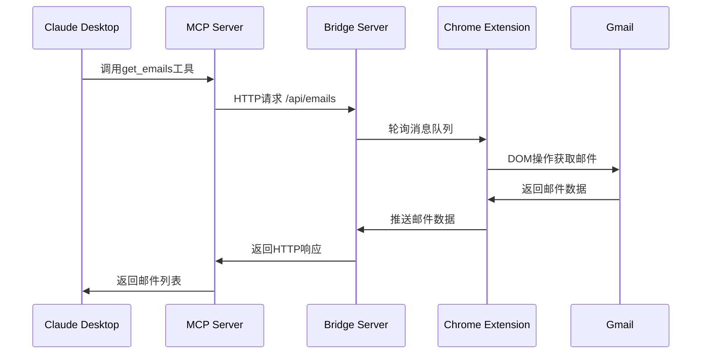

# 技术架构文档

> **Gmail MCP Bridge 系统设计与实现细节**

## 🎯 架构设计理念

Gmail MCP Bridge 基于以下核心原则设计：

1. **数据结构优先** - 好的数据结构让代码自然简洁
2. **消除特殊情况** - 统一的处理机制，减少条件分支
3. **实用主义** - 解决真实用户问题，不追求理论完美
4. **向后兼容** - 任何改动都不破坏现有用户的使用

## 🏗️ 整体架构

### 系统层次结构

```
┌─────────────────────────────────────────────────────────────┐
│                        用户层                                │
│  Claude Desktop    Chrome Browser    CLI工具    Web界面     │
└─────────────────────┬───────────────────────────────────────┘
                      │
┌─────────────────────┴───────────────────────────────────────┐
│                      协议层                                  │
│         MCP协议        HTTP API        Native Messaging     │
└─────────────────────┬───────────────────────────────────────┘
                      │
┌─────────────────────┴───────────────────────────────────────┐
│                      服务层                                  │
│    MCP服务器      Bridge服务器      状态管理      错误处理   │
└─────────────────────┬───────────────────────────────────────┘
                      │
┌─────────────────────┴───────────────────────────────────────┐
│                      扩展层                                  │
│  Chrome Extension    Content Scripts    Background Service  │
└─────────────────────┬───────────────────────────────────────┘
                      │
┌─────────────────────┴───────────────────────────────────────┐
│                      应用层                                  │
│              Gmail Web Interface                            │
└─────────────────────────────────────────────────────────────┘
```

### 数据流示例



---

## 🧠 核心组件详解

### 1. MCP服务器 (MCP Server)

**文件位置**: `mcp-server/index.js`

**职责**：
- 实现MCP协议规范
- 提供工具接口给Claude Desktop
- 管理与Bridge服务器的通信

**核心类设计**：

```javascript
class MCPServer {
  constructor() {
    this.tools = new Map();
    this.bridge = new BridgeClient('http://localhost:3456');
    this.config = new ConfigManager();
  }
  
  // MCP工具定义
  initializeTools() {
    this.tools.set('list_emails', {
      name: 'list_emails',
      description: 'List emails from Gmail inbox',
      inputSchema: {
        type: 'object',
        properties: {
          limit: { type: 'number', default: 10 },
          unread_only: { type: 'boolean', default: false }
        }
      }
    });
    // ... 更多工具
  }
  
  // 工具调用处理
  async callTool(name, args) {
    const tool = this.tools.get(name);
    if (!tool) {
      throw new Error(`Unknown tool: ${name}`);
    }
    
    return await this.bridge.request(`/api/${name}`, args);
  }
}
```

### 2. Bridge服务器 (Bridge Server)

**文件位置**: `mcp-server/bridge-server.js`

**职责**：
- HTTP API服务器
- MCP服务器和Chrome扩展的通信桥梁
- 请求队列管理和响应路由

**核心架构**：

```javascript
class BridgeServer {
  constructor(port = 3456) {
    this.port = port;
    this.pendingRequests = new Map(); // requestId -> Promise
    this.chromeClients = new Set();   // 连接的Chrome扩展
    this.messageQueue = [];           // 消息队列
    this.app = express();
  }
  
  // API路由定义
  setupRoutes() {
    this.app.get('/health', this.healthCheck);
    this.app.post('/api/:action', this.handleApiRequest);
    this.app.get('/poll', this.handlePoll);  // Chrome扩展轮询
    this.app.post('/response', this.handleResponse);
  }
  
  // 核心：请求-响应机制
  async handleApiRequest(req, res) {
    const { action } = req.params;
    const requestId = this.generateRequestId();
    
    // 将请求发送到Chrome扩展
    const message = {
      id: requestId,
      action: action,
      data: req.body,
      timestamp: Date.now()
    };
    
    this.messageQueue.push(message);
    
    // 等待Chrome扩展响应
    try {
      const result = await this.waitForResponse(requestId, 10000);
      res.json({ success: true, data: result });
    } catch (error) {
      res.status(500).json({ success: false, error: error.message });
    }
  }
}
```

### 3. Chrome扩展 (Chrome Extension)

**文件位置**: `extension/` 目录

**架构组成**：

- **manifest.json** - 扩展配置和权限声明
- **background.js** - 服务工作者，处理Bridge通信
- **content.js** - 内容脚本，操作Gmail DOM
- **popup.js** - 扩展弹窗，用户界面

**Background Script设计**：

```javascript
class ExtensionBackground {
  constructor() {
    this.bridgeUrl = 'http://localhost:3456';
    this.pollInterval = 1000;
    this.isConnected = false;
  }
  
  // 轮询Bridge服务器获取消息
  async pollMessages() {
    try {
      const response = await fetch(`${this.bridgeUrl}/poll`);
      const messages = await response.json();
      
      for (const message of messages) {
        await this.processMessage(message);
      }
    } catch (error) {
      console.error('Poll failed:', error);
      this.isConnected = false;
    }
  }
  
  // 处理来自Bridge的消息
  async processMessage(message) {
    const { id, action, data } = message;
    
    try {
      // 向Gmail标签页发送消息
      const result = await this.sendToContentScript(action, data);
      
      // 将结果发送回Bridge
      await this.sendResponse(id, result);
    } catch (error) {
      await this.sendError(id, error);
    }
  }
}
```

**Content Script设计**：

```javascript
class GmailController {
  constructor() {
    this.selectors = {
      emailList: 'tr.zA',
      emailSubject: 'span[data-thread-id] span[id*=":"]',
      composeButton: '.T-I.T-I-KE.L3',
      // ... 更多选择器
    };
  }
  
  // 获取邮件列表
  getEmails(options = {}) {
    const { limit = 10, unread_only = false } = options;
    const rows = document.querySelectorAll(this.selectors.emailList);
    
    const emails = Array.from(rows)
      .slice(0, limit)
      .filter(row => !unread_only || this.isUnread(row))
      .map(row => this.extractEmailData(row));
    
    return emails;
  }
  
  // 发送邮件
  async sendEmail({ to, subject, body }) {
    // 点击撰写按钮
    const composeBtn = document.querySelector(this.selectors.composeButton);
    composeBtn.click();
    
    // 等待撰写界面加载
    await this.waitForComposer();
    
    // 填写表单
    this.fillComposer({ to, subject, body });
    
    // 发送邮件
    await this.clickSend();
  }
}
```

---

## 🔄 数据状态管理

### 系统状态模型

```javascript
class SystemState {
  constructor() {
    this.components = {
      mcpServer: {
        status: 'unknown',    // unknown, starting, running, error
        lastCheck: null,
        pid: null,
        version: null
      },
      bridgeServer: {
        status: 'unknown',
        port: 3456,
        lastHeartbeat: null,
        connectedClients: 0
      },
      chromeExtension: {
        status: 'unknown',
        id: null,
        version: null,
        isConnected: false
      },
      gmail: {
        tabs: [],            // [{ tabId, url, account, isActive }]
        currentAccount: null,
        isLoggedIn: false
      }
    };
    
    this.metrics = {
      responseTime: new RollingAverage(100),
      errorRate: new RollingAverage(50),
      successRate: new RollingAverage(50),
      uptime: Date.now()
    };
    
    this.errors = new Map();  // errorId -> ErrorInfo
  }
}
```

### 配置管理架构

```javascript
class ConfigurationManager {
  constructor() {
    this.configs = new Map();
    this.watchers = new Map();
    this.validators = new Map();
  }
  
  // 统一配置更新机制
  async updateConfig(path, updates) {
    const backup = await this.createBackup(path);
    
    try {
      const current = await this.loadConfig(path);
      const merged = this.mergeConfig(current, updates);
      
      await this.validateConfig(path, merged);
      await this.saveConfig(path, merged);
      
      this.notifyWatchers(path, merged);
      
      return merged;
    } catch (error) {
      await this.restoreBackup(path, backup);
      throw error;
    }
  }
}
```

---

## 🛡️ 错误处理机制

### 统一错误处理

```javascript
class ErrorManager {
  constructor() {
    this.errorCodes = new Map();
    this.handlers = new Map();
    this.userMessages = new Map();
    
    this.initializeErrorMappings();
  }
  
  // 错误分类和处理
  async handleError(error, context = {}) {
    const errorInfo = this.classifyError(error, context);
    const handler = this.getHandler(errorInfo.code);
    
    if (handler.autoFix && await handler.canAutoFix(errorInfo)) {
      try {
        await handler.autoFix(errorInfo);
        return { resolved: true, action: 'auto_fixed' };
      } catch (fixError) {
        // 自动修复失败，降级到手动处理
        return this.createManualResolution(errorInfo);
      }
    }
    
    return this.createManualResolution(errorInfo);
  }
  
  initializeErrorMappings() {
    // Bridge连接错误
    this.errorCodes.set('BRIDGE_CONNECTION_FAILED', {
      severity: 'high',
      category: 'network',
      autoFixable: true
    });
    
    this.handlers.set('BRIDGE_CONNECTION_FAILED', {
      canAutoFix: async () => await this.checkBridgeServer(),
      autoFix: async () => await this.restartBridge(),
      manualSteps: [
        '检查Bridge服务器是否运行',
        '运行 npm run bridge 重启服务',
        '检查端口3456是否被占用'
      ]
    });
  }
}
```

### 自动恢复机制

```javascript
class AutoRecovery {
  constructor() {
    this.strategies = new Map();
    this.monitors = new Set();
    this.recoveryHistory = [];
  }
  
  // 组件故障自动恢复
  async recoverComponent(component, error) {
    const strategy = this.strategies.get(component);
    if (!strategy) {
      return { success: false, reason: 'no_strategy' };
    }
    
    const steps = strategy.getRecoverySteps(error);
    
    for (const step of steps) {
      try {
        await step.execute();
        
        if (await step.verify()) {
          return { success: true, step: step.name };
        }
      } catch (stepError) {
        console.error(`Recovery step ${step.name} failed:`, stepError);
      }
    }
    
    return { success: false, reason: 'all_steps_failed' };
  }
}
```

---

## 🚀 性能优化

### 缓存系统

```javascript
class IntelligentCache {
  constructor() {
    this.cache = new Map();
    this.stats = {
      hits: 0,
      misses: 0,
      evictions: 0
    };
    this.ttlTimers = new Map();
  }
  
  // 智能缓存策略
  async get(key, fetcher, options = {}) {
    if (this.has(key) && !this.isExpired(key)) {
      this.stats.hits++;
      return this.cache.get(key).value;
    }
    
    this.stats.misses++;
    const value = await fetcher();
    
    this.set(key, value, {
      ttl: this.calculateTTL(key, options),
      priority: this.calculatePriority(key, options)
    });
    
    return value;
  }
  
  calculateTTL(key, options) {
    // 基于数据类型和访问模式的动态TTL
    const patterns = {
      'gmail-emails': 30000,     // 30秒
      'system-status': 5000,     // 5秒  
      'user-config': 300000,     // 5分钟
      'error-info': 60000        // 1分钟
    };
    
    const keyType = this.getKeyType(key);
    return options.ttl || patterns[keyType] || 60000;
  }
}
```

### 连接池管理

```javascript
class ConnectionPool {
  constructor(maxConnections = 5) {
    this.maxConnections = maxConnections;
    this.activeConnections = new Map();
    this.idleConnections = new Set();
    this.waitingQueue = [];
  }
  
  // 连接复用
  async getConnection(target) {
    // 复用空闲连接
    for (const conn of this.idleConnections) {
      if (conn.target === target && conn.isHealthy()) {
        this.idleConnections.delete(conn);
        this.activeConnections.set(conn.id, conn);
        return conn;
      }
    }
    
    // 创建新连接
    if (this.activeConnections.size < this.maxConnections) {
      const conn = await this.createConnection(target);
      this.activeConnections.set(conn.id, conn);
      return conn;
    }
    
    // 等待连接释放
    return new Promise((resolve, reject) => {
      this.waitingQueue.push({ target, resolve, reject });
    });
  }
}
```

---

## 🔐 安全架构

### 数据隐私保护

```javascript
class PrivacyController {
  constructor() {
    this.sensitiveFields = new Set([
      'email_content', 'password', 'auth_token'
    ]);
    this.processors = new Map();
  }
  
  // 数据脱敏处理
  sanitizeData(data, context = {}) {
    if (typeof data !== 'object') {
      return data;
    }
    
    const sanitized = {};
    
    for (const [key, value] of Object.entries(data)) {
      if (this.sensitiveFields.has(key)) {
        sanitized[key] = this.maskSensitiveValue(value);
      } else if (typeof value === 'object') {
        sanitized[key] = this.sanitizeData(value, context);
      } else {
        sanitized[key] = value;
      }
    }
    
    return sanitized;
  }
  
  // 本地数据处理原则
  processEmailData(emailData) {
    return {
      // 只保留必要的元数据
      id: emailData.id,
      subject: emailData.subject,
      from: emailData.from,
      timestamp: emailData.timestamp,
      // 不存储邮件正文
      hasAttachments: emailData.attachments?.length > 0,
      isRead: emailData.isRead
    };
  }
}
```

### 权限控制

```javascript
class PermissionManager {
  constructor() {
    this.permissions = new Map();
    this.policies = new Map();
  }
  
  // 最小权限验证
  async checkPermission(action, resource, context) {
    const required = this.getRequiredPermissions(action, resource);
    const granted = await this.getGrantedPermissions(context);
    
    return required.every(perm => granted.includes(perm));
  }
  
  // Chrome扩展权限管理
  async requestChromePermissions(permissions) {
    return new Promise((resolve) => {
      chrome.permissions.request({
        permissions: permissions
      }, (granted) => {
        resolve(granted);
      });
    });
  }
}
```

---

## 📊 监控和指标

### 性能监控

```javascript
class PerformanceMonitor {
  constructor() {
    this.metrics = new Map();
    this.thresholds = new Map();
    this.alerts = new Set();
  }
  
  // 性能指标收集
  recordMetric(name, value, labels = {}) {
    const key = this.buildMetricKey(name, labels);
    
    if (!this.metrics.has(key)) {
      this.metrics.set(key, new MetricSeries());
    }
    
    const series = this.metrics.get(key);
    series.add(value, Date.now());
    
    // 检查阈值告警
    this.checkThresholds(name, value, labels);
  }
  
  // 系统健康检查
  async healthCheck() {
    const components = ['mcp', 'bridge', 'extension', 'gmail'];
    const results = {};
    
    for (const component of components) {
      try {
        results[component] = await this.checkComponent(component);
      } catch (error) {
        results[component] = {
          status: 'error',
          error: error.message
        };
      }
    }
    
    return {
      overall: this.calculateOverallHealth(results),
      components: results,
      timestamp: Date.now()
    };
  }
}
```

---

## 🔄 升级和兼容性

### 向前兼容设计

```javascript
class VersionManager {
  constructor() {
    this.supportedVersions = ['1.0.0', '1.1.0', '2.0.0'];
    this.migrators = new Map();
    this.validators = new Map();
  }
  
  // 配置迁移
  async migrateConfig(config, targetVersion) {
    const currentVersion = this.detectVersion(config);
    
    if (this.isCompatible(currentVersion, targetVersion)) {
      return config;
    }
    
    const migrationPath = this.findMigrationPath(currentVersion, targetVersion);
    
    let migratedConfig = config;
    for (const step of migrationPath) {
      migratedConfig = await this.executeMigration(step, migratedConfig);
    }
    
    return migratedConfig;
  }
  
  // 向后兼容检查
  isBackwardCompatible(newVersion, oldVersion) {
    // 主版本号相同时保证向后兼容
    const [newMajor] = newVersion.split('.');
    const [oldMajor] = oldVersion.split('.');
    
    return newMajor === oldMajor;
  }
}
```

---

## 🛠️ 开发工具和调试

### 开发环境设置

```bash
# 开发环境快速启动
npm run dev:setup    # 安装依赖并配置开发环境
npm run dev:start    # 启动所有服务（热重载）
npm run dev:test     # 运行测试套件
npm run dev:debug    # 启动调试模式
```

### 调试工具

```javascript
class DebugHelper {
  constructor() {
    this.logLevel = process.env.DEBUG_LEVEL || 'info';
    this.debugModules = new Set(process.env.DEBUG?.split(',') || []);
  }
  
  // 结构化日志
  log(level, module, message, data = {}) {
    if (!this.shouldLog(level, module)) {
      return;
    }
    
    const logEntry = {
      timestamp: new Date().toISOString(),
      level,
      module,
      message,
      data,
      pid: process.pid
    };
    
    console.log(JSON.stringify(logEntry));
  }
  
  // 性能分析
  profile(name, fn) {
    const start = performance.now();
    
    return Promise.resolve(fn()).finally(() => {
      const duration = performance.now() - start;
      this.log('debug', 'profiler', `${name} took ${duration.toFixed(2)}ms`);
    });
  }
}
```

---

## 📋 部署架构

### 生产环境部署

```yaml
# docker-compose.yml
version: '3.8'
services:
  mcp-server:
    build: ./mcp-server
    ports:
      - "3455:3455"
    environment:
      - NODE_ENV=production
      - LOG_LEVEL=info
    restart: unless-stopped
    
  bridge-server:
    build: ./mcp-server
    command: npm run bridge
    ports:
      - "3456:3456"
    environment:
      - NODE_ENV=production
      - CORS_ORIGIN=chrome-extension://*
    restart: unless-stopped
    depends_on:
      - mcp-server
```

### 监控和告警

```javascript
class ProductionMonitoring {
  constructor() {
    this.alertChannels = new Map();
    this.healthChecks = new Map();
  }
  
  // 系统监控
  startMonitoring() {
    // 每30秒检查系统健康
    setInterval(async () => {
      const health = await this.checkSystemHealth();
      if (!health.healthy) {
        await this.triggerAlert('system_unhealthy', health);
      }
    }, 30000);
    
    // 每5分钟检查性能指标
    setInterval(async () => {
      const metrics = await this.collectMetrics();
      if (this.detectAnomalies(metrics)) {
        await this.triggerAlert('performance_anomaly', metrics);
      }
    }, 300000);
  }
}
```

---

## 🎯 最佳实践

### 代码组织原则

1. **单一职责** - 每个模块只负责一个功能
2. **依赖注入** - 避免硬编码依赖
3. **错误边界** - 错误不应该跨模块传播
4. **配置外部化** - 所有配置都可以外部修改

### 性能优化指南

1. **缓存策略** - 根据数据特性选择合适的缓存TTL
2. **连接复用** - 避免频繁创建HTTP连接
3. **批量操作** - 合并多个小请求为批量请求
4. **异步处理** - 避免阻塞主线程

### 安全最佳实践

1. **最小权限** - 只申请必要的权限
2. **数据脱敏** - 敏感数据不存储、不传输
3. **输入验证** - 所有外部输入都要验证
4. **错误处理** - 不泄露系统内部信息

---

**这个架构文档反映了 Gmail MCP Bridge 的核心设计理念：简单、实用、可靠。通过良好的数据结构设计和统一的错误处理机制，系统在保持功能完整性的同时，实现了高度的可维护性和扩展性。**