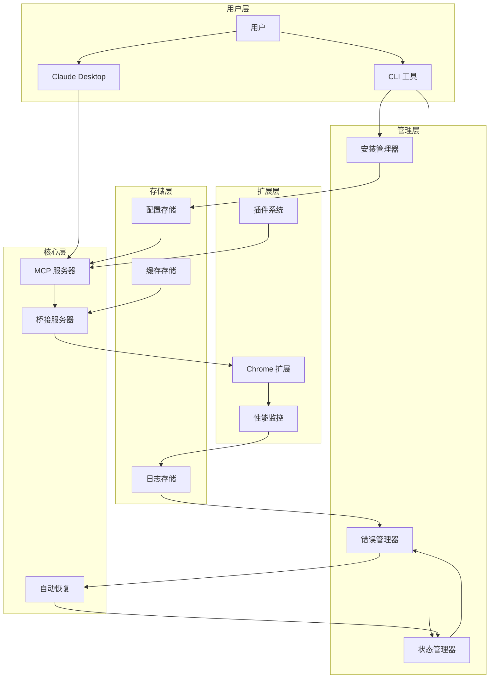

# Gmail MCP Bridge 架构设计 v2.0

## 🎯 设计理念

基于 Linus Torvalds 的"好品味"原则，我们重新设计 Gmail MCP Bridge 架构：

1. **消除特殊情况** - 统一的错误处理，统一的配置管理
2. **数据结构优先** - 先设计好数据流，代码自然简洁
3. **实用主义** - 解决真实用户问题，不追求理论完美
4. **向后兼容** - 任何改动都不能破坏现有用户的使用

## 🏗️ 整体架构图



---

## 🧠 核心数据结构

### SystemState - 系统状态的唯一真实来源
```javascript
class SystemState {
  constructor() {
    this.components = {
      mcpServer: { status: 'unknown', lastCheck: null, pid: null },
      bridgeServer: { status: 'unknown', port: 3456, lastHeartbeat: null },
      chromeExtension: { status: 'unknown', id: null, version: null },
      gmailTabs: [], // [{ tabId, url, accountEmail, isActive }]
      claudeDesktop: { status: 'unknown', configPath: null, version: null }
    };
    
    this.metrics = {
      responseTime: [],
      errorCount: 0,
      successCount: 0,
      uptime: Date.now()
    };
    
    this.errors = new Map(); // errorId -> ErrorInfo
    this.recovery = new Map(); // componentId -> RecoveryState
  }
  
  // 核心操作：更新状态但保持数据一致性
  updateComponent(name, update) {
    const prev = this.components[name];
    this.components[name] = { ...prev, ...update, lastUpdate: Date.now() };
    this.notifyWatchers(name, this.components[name]);
  }
}
```

### ConfigurationManager - 配置管理的统一接口
```javascript
class ConfigurationManager {
  constructor() {
    this.configs = new Map(); // path -> ConfigFile
    this.templates = new Map(); // name -> Template
    this.backups = new Map(); // path -> BackupInfo
  }
  
  // 好品味：统一处理所有配置操作
  async updateConfig(path, transformer) {
    const backup = await this.createBackup(path);
    try {
      const current = await this.readConfig(path);
      const updated = transformer(current);
      await this.writeConfig(path, updated);
      await this.validateConfig(path, updated);
    } catch (error) {
      await this.restoreBackup(path, backup);
      throw error;
    }
  }
}
```

---

## 🔄 核心组件重构

### 1. 统一安装器 (Installer)

```javascript
class UniversalInstaller {
  constructor() {
    this.platform = new PlatformAdapter();
    this.detector = new SystemDetector();
    this.config = new ConfigurationManager();
    this.ui = new InstallationUI();
  }
  
  // 消除特殊情况：所有平台用同一个安装流程
  async install() {
    const steps = [
      () => this.detector.checkPrerequisites(),
      () => this.platform.setupEnvironment(),
      () => this.config.generateConfigs(),
      () => this.validateInstallation()
    ];
    
    for (const [index, step] of steps.entries()) {
      this.ui.updateProgress((index + 1) / steps.length);
      await step();
    }
  }
}
```

### 2. 智能错误处理 (Error Handler)

```javascript
class IntelligentErrorHandler {
  constructor() {
    this.errorCodes = new Map();
    this.solutions = new Map();
    this.userMessages = new Map();
    
    this.initializeErrorMappings();
  }
  
  // 好品味：错误处理不应该有特殊情况
  async handleError(error) {
    const errorInfo = this.classifyError(error);
    const solution = this.findSolution(errorInfo);
    const userMessage = this.generateUserMessage(errorInfo, solution);
    
    if (solution.autoFixable) {
      const result = await this.attemptAutoFix(solution);
      if (result.success) {
        return { resolved: true, message: userMessage.success };
      }
    }
    
    return {
      resolved: false,
      message: userMessage.manual,
      actions: solution.userActions
    };
  }
  
  initializeErrorMappings() {
    // 用数据结构解决问题，而不是 if/else 地狱
    this.errorCodes.set('CHROME_EXT_NOT_FOUND', {
      severity: 'high',
      category: 'configuration',
      autoFixable: true
    });
    
    this.solutions.set('CHROME_EXT_NOT_FOUND', {
      autoFix: async () => this.reinstallExtension(),
      userActions: ['重启浏览器', '重新安装扩展']
    });
    
    this.userMessages.set('CHROME_EXT_NOT_FOUND', {
      manual: 'Chrome扩展未找到。点击"修复"按钮自动处理。',
      success: '扩展已重新安装并激活。'
    });
  }
}
```

### 3. 自适应状态管理 (Status Manager)

```javascript
class AdaptiveStatusManager {
  constructor() {
    this.state = new SystemState();
    this.watchers = new Map();
    this.healthCheckers = new Map();
    this.recoveryStrategies = new Map();
  }
  
  // 实用主义：只监控真正重要的状态
  startMonitoring() {
    const criticalComponents = ['mcpServer', 'bridgeServer', 'chromeExtension'];
    
    for (const component of criticalComponents) {
      this.scheduleHealthCheck(component, this.getCheckInterval(component));
    }
  }
  
  // 好品味：状态变化处理没有特殊情况
  async onStatusChange(component, newStatus, oldStatus) {
    this.state.updateComponent(component, newStatus);
    
    if (this.isHealthy(newStatus)) {
      this.clearRecovery(component);
    } else {
      await this.triggerRecovery(component, newStatus);
    }
    
    this.notifyWatchers(component, newStatus);
  }
}
```

---

## 🎨 用户界面架构

### 扩展 UI 组件化设计

```javascript
// 基础组件
class StatusCard extends Component {
  render({ title, status, metrics, actions }) {
    return `
      <div class="status-card ${status.toLowerCase()}">
        <h3>${title}</h3>
        <div class="status-indicator ${status}"></div>
        <div class="metrics">${this.renderMetrics(metrics)}</div>
        <div class="actions">${this.renderActions(actions)}</div>
      </div>
    `;
  }
}

// 复合组件
class SystemDashboard extends Component {
  constructor() {
    this.statusManager = new StatusManager();
    this.components = ['mcp', 'bridge', 'extension', 'gmail'];
  }
  
  render() {
    return `
      <div class="dashboard">
        ${this.components.map(comp => 
          new StatusCard().render(this.statusManager.getStatus(comp))
        ).join('')}
      </div>
    `;
  }
}
```

---

## 🔧 性能优化策略

### 1. 智能缓存系统
```javascript
class IntelligentCache {
  constructor() {
    this.cache = new Map();
    this.ttl = new Map();
    this.hitRates = new Map();
  }
  
  // 好品味：缓存策略基于数据访问模式
  async get(key, fetcher) {
    if (this.isValid(key)) {
      this.updateHitRate(key, true);
      return this.cache.get(key);
    }
    
    const value = await fetcher();
    this.set(key, value, this.calculateTTL(key));
    this.updateHitRate(key, false);
    return value;
  }
  
  calculateTTL(key) {
    // 根据数据类型和访问模式动态调整 TTL
    const patterns = {
      'gmail-emails': 30000,      // 30秒
      'system-status': 5000,      // 5秒
      'user-config': 300000       // 5分钟
    };
    
    return patterns[this.getKeyType(key)] || 60000;
  }
}
```

### 2. 连接池管理
```javascript
class ConnectionPool {
  constructor() {
    this.connections = new Map();
    this.available = new Set();
    this.inUse = new Set();
    this.maxConnections = 5;
  }
  
  // 实用主义：连接复用解决性能问题
  async getConnection(target) {
    if (this.available.has(target)) {
      const conn = this.available.get(target);
      this.available.delete(target);
      this.inUse.add(target, conn);
      return conn;
    }
    
    if (this.inUse.size < this.maxConnections) {
      const conn = await this.createConnection(target);
      this.inUse.set(target, conn);
      return conn;
    }
    
    // 等待连接释放
    return this.waitForConnection(target);
  }
}
```

---

## 🔐 安全和隐私设计

### 1. 本地数据处理
```javascript
class PrivacyController {
  constructor() {
    this.dataProcessors = new Map();
    this.privacyRules = new Map();
  }
  
  // 隐私设计原则：数据不离开用户设备
  async processEmailData(rawData) {
    // 移除敏感信息
    const sanitized = this.sanitizeEmailData(rawData);
    
    // 本地处理
    const processed = this.extractEmailMetadata(sanitized);
    
    // 不存储邮件内容
    return {
      metadata: processed,
      content: null, // 内容不存储
      accessTime: Date.now()
    };
  }
}
```

### 2. 权限管理
```javascript
class PermissionManager {
  constructor() {
    this.permissions = new Map();
    this.requests = new Set();
  }
  
  // 最小权限原则
  async requestPermission(action, context) {
    const required = this.getRequiredPermissions(action);
    const current = await this.getCurrentPermissions();
    const missing = required.filter(p => !current.includes(p));
    
    if (missing.length === 0) {
      return true;
    }
    
    return this.promptUser(missing, context);
  }
}
```

---

## 📊 监控和遥测

### 1. 性能指标收集
```javascript
class PerformanceCollector {
  constructor() {
    this.metrics = {
      responseTime: new RollingAverage(100),
      memoryUsage: new RollingAverage(50),
      errorRate: new RollingAverage(20)
    };
  }
  
  // 收集但不发送的遥测
  collectMetric(name, value) {
    if (this.metrics[name]) {
      this.metrics[name].add(value);
    }
    
    // 只在本地存储和显示
    this.updateLocalDashboard(name, value);
  }
}
```

---

## 🔄 升级和迁移策略

### 1. 向前兼容设计
```javascript
class MigrationManager {
  constructor() {
    this.migrations = new Map();
    this.versions = ['1.0.0', '2.0.0', '2.1.0'];
  }
  
  // Never break userspace
  async migrate(fromVersion, toVersion) {
    const path = this.findMigrationPath(fromVersion, toVersion);
    
    for (const step of path) {
      await this.executeStep(step);
      await this.validateStep(step);
    }
    
    // 保留旧配置作为备份
    await this.preserveOldConfig(fromVersion);
  }
}
```

### 2. 配置版本管理
```javascript
class ConfigVersioning {
  constructor() {
    this.schema = new Map();
    this.transformers = new Map();
  }
  
  // 处理配置格式变化
  async upgradeConfig(config, targetVersion) {
    const currentVersion = this.detectVersion(config);
    
    if (currentVersion === targetVersion) {
      return config;
    }
    
    const transformer = this.getTransformer(currentVersion, targetVersion);
    return transformer(config);
  }
}
```

---

## 🚀 部署和分发

### 1. 自动化构建流程
```yaml
# 构建流程
build:
  steps:
    - name: 环境检测
      run: node scripts/detect-env.js
    
    - name: 依赖安装
      run: npm ci --production
    
    - name: 代码压缩
      run: npm run build
    
    - name: 测试验证
      run: npm run test:integration
    
    - name: 打包分发
      run: npm run package
```

### 2. 渐进式部署
```javascript
class ProgressiveDeployment {
  constructor() {
    this.rolloutStrategy = 'canary'; // canary -> beta -> stable
    this.rollbackTriggers = ['error_rate > 5%', 'user_complaints > 10'];
  }
  
  async deployUpdate(version) {
    // 金丝雀部署：先给 5% 用户
    await this.canaryRelease(version, 0.05);
    
    // 监控关键指标
    const metrics = await this.monitorDeployment(version, '1h');
    
    if (this.shouldRollback(metrics)) {
      await this.rollback(version);
      return false;
    }
    
    // 全量部署
    await this.fullRelease(version);
    return true;
  }
}
```

---

## 🎯 关键设计决策

### 1. 为什么选择这种架构？

**数据结构优先**：
- `SystemState` 作为唯一真实来源，消除状态不一致
- 配置、错误、恢复都用 Map 管理，避免条件分支地狱

**消除特殊情况**：
- 所有平台用同一个安装流程，差异在适配器层处理
- 所有错误用同一套处理机制，差异在映射表中定义

**实用主义**：
- 只解决用户真正遇到的问题
- 不追求理论上的完美，专注实际效果

### 2. 架构演进路径

```mermaid
graph LR
    V1[v1.0 基础功能] --> V2[v2.0 用户体验]
    V2 --> V3[v3.0 企业特性]
    V3 --> V4[v4.0 生态扩展]
    
    V1: Basic MCP Bridge
    V2: Auto Install + Error Handling
    V3: Multi-tenant + Security
    V4: Plugin System + API
```

### 3. 技术债务管理

**立即重构**：
- 去除所有 console.log（用结构化日志）
- 统一错误处理（不再有 try-catch 地狱）
- 配置管理集中化（不再散布各处）

**渐进改进**：
- 性能优化（缓存、连接池）
- 监控完善（指标收集、告警）
- 扩展性增强（插件系统）

这个架构设计遵循了 Linus 的核心哲学：**简单、实用、不破坏现有功能**。通过良好的数据结构设计，大部分复杂性被消除，代码变得简洁而强壮。