# Gmail MCP Bridge 任务分解表

## 📊 总体工作量估算

| 模块 | 预估工作量 | 难度 | 优先级 | 并行度 |
|------|-----------|------|-------|--------|
| A: 自动化安装 | 3-4 工作日 | 🟡 中 | P0 | 可与B并行 |
| B: 错误处理 | 2-3 工作日 | 🟢 低 | P1 | 可与A并行 |
| C: 可视化界面 | 2-3 工作日 | 🟢 低 | P1 | 可与E并行 |
| D: CLI工具 | 2 工作日 | 🟢 低 | P2 | 可与F并行 |
| E: 文档指南 | 1-2 工作日 | 🟢 低 | P2 | 可与C并行 |
| F: 健壮性扩展 | 2-3 工作日 | 🟡 中 | P3 | 可与D并行 |

**总工作量**: 12-17 工作日（约 2.5-3.5 周）  
**并行执行**: 可压缩至 2-2.5 周完成

---

## 🎯 模块 A: 自动化安装系统

### A.1 统一安装器开发 【1.5 工作日】

#### A.1.1 核心安装逻辑 【0.5 工作日】
**文件**: `tools/installer/installer.js`
```javascript
// 主要任务
- [ ] InstallationManager 类设计
- [ ] 安装步骤流程控制
- [ ] 错误处理和回滚机制
- [ ] 进度反馈系统
```

#### A.1.2 系统环境检测 【0.5 工作日】
**文件**: `tools/installer/system-detector.js`
```javascript
// 主要任务
- [ ] Node.js 版本检测
- [ ] Chrome 浏览器检测
- [ ] Claude Desktop 安装检测
- [ ] 操作系统兼容性检查
- [ ] 权限检查（文件读写、网络访问）
```

#### A.1.3 用户交互界面 【0.5 工作日】
**文件**: `tools/installer/ui.js`
```javascript
// 主要任务
- [ ] 命令行进度条
- [ ] 用户确认对话框
- [ ] 错误信息显示
- [ ] 安装完成提示
```

### A.2 智能配置生成 【1 工作日】

#### A.2.1 Claude Desktop 配置管理 【0.5 工作日】
**文件**: `tools/installer/claude-config.js`
```javascript
// 主要任务
- [ ] 自动定位配置文件路径
- [ ] JSON 配置安全解析和修改
- [ ] 配置备份和恢复
- [ ] 配置验证和格式化
```

#### A.2.2 扩展配置自动化 【0.5 工作日】
**文件**: `tools/installer/extension-manager.js`
```javascript
// 主要任务
- [ ] 扩展 ID 自动获取
- [ ] Native Messaging 配置生成
- [ ] 扩展安装验证
- [ ] 权限检查和修复
```

### A.3 跨平台兼容性 【0.5 工作日】

#### A.3.1 平台适配器 【0.5 工作日】
**文件**: `tools/installer/platform-adapters.js`
```javascript
// 主要任务
- [ ] macOS 路径和权限处理
- [ ] Windows 注册表操作
- [ ] Linux 桌面环境适配
- [ ] 路径解析统一接口
```

---

## 🛡️ 模块 B: 错误处理和状态管理

### B.1 集中式状态管理 【1 工作日】

#### B.1.1 状态管理核心 【0.5 工作日】
**文件**: `src/core/status-manager.js`
```javascript
// 主要任务
- [ ] StatusManager 类设计
- [ ] 实时状态监控机制
- [ ] 状态变更事件系统
- [ ] 状态持久化存储
```

#### B.1.2 健康检查系统 【0.5 工作日】
**文件**: `src/core/health-checker.js`
```javascript
// 主要任务
- [ ] 组件健康检查逻辑
- [ ] 定期检查调度器
- [ ] 健康状态评分算法
- [ ] 性能指标收集
```

### B.2 用户友好错误处理 【0.5 工作日】

#### B.2.1 错误处理核心 【0.5 工作日】
**文件**: `src/core/error-handler.js`
```javascript
// 主要任务
- [ ] 错误代码标准化
- [ ] 用户友好消息映射
- [ ] 解决方案建议引擎
- [ ] 错误统计和分析
```

### B.3 自动恢复机制 【0.5-1 工作日】

#### B.3.1 自动恢复逻辑 【0.5 工作日】
**文件**: `src/core/auto-recovery.js`
```javascript
// 主要任务
- [ ] 连接中断检测
- [ ] 自动重连策略
- [ ] 服务重启机制
- [ ] 恢复成功率统计
```

#### B.3.2 故障预防机制 【可选 0.5 工作日】
**文件**: `src/core/fault-prevention.js`
```javascript
// 主要任务
- [ ] 资源使用监控
- [ ] 性能降级策略
- [ ] 预警系统
```

---

## 🎨 模块 C: 可视化界面和监控

### C.1 扩展 UI 重构 【1.5 工作日】

#### C.1.1 状态仪表板 【0.5 工作日】
**文件**: `extension/ui/status-dashboard.html` + `extension/ui/status-dashboard.js`
```javascript
// 主要任务
- [ ] 实时状态卡片组件
- [ ] 性能指标可视化
- [ ] 响应式布局设计
- [ ] 状态动画效果
```

#### C.1.2 安装向导界面 【0.5 工作日】
**文件**: `extension/ui/setup-wizard.html` + `extension/ui/setup-wizard.js`
```javascript
// 主要任务
- [ ] 分步安装引导
- [ ] 进度条和状态指示
- [ ] 用户输入验证
- [ ] 安装结果反馈
```

#### C.1.3 故障排除面板 【0.5 工作日】
**文件**: `extension/ui/troubleshoot.html` + `extension/ui/troubleshoot.js`
```javascript
// 主要任务
- [ ] 问题诊断界面
- [ ] 一键修复按钮
- [ ] 详细日志查看
- [ ] 专家模式切换
```

### C.2 实时监控系统 【0.5-1 工作日】

#### C.2.1 性能监控 【0.5 工作日】
**文件**: `extension/monitoring/performance-monitor.js`
```javascript
// 主要任务
- [ ] API 响应时间统计
- [ ] 内存使用情况追踪
- [ ] 错误率计算
- [ ] 历史数据存储
```

#### C.2.2 用户行为分析 【可选 0.5 工作日】
**文件**: `extension/monitoring/usage-analytics.js`
```javascript
// 主要任务
- [ ] 功能使用频率统计
- [ ] 用户操作路径分析
- [ ] 隐私安全的数据收集
```

---

## 🔧 模块 D: CLI 工具和开发体验

### D.1 用户友好 CLI 【1 工作日】

#### D.1.1 CLI 核心框架 【0.5 工作日】
**文件**: `bin/gmail-mcp`
```javascript
// 主要任务
- [ ] 命令路由系统
- [ ] 参数解析和验证
- [ ] 帮助文档生成
- [ ] 彩色输出和格式化
```

#### D.1.2 核心命令实现 【0.5 工作日】
```bash
# 需要实现的命令
- [ ] gmail-mcp install    # 自动安装
- [ ] gmail-mcp status     # 状态检查
- [ ] gmail-mcp doctor     # 问题诊断
- [ ] gmail-mcp fix        # 自动修复
- [ ] gmail-mcp test       # 功能测试
- [ ] gmail-mcp uninstall  # 完全卸载
```

### D.2 系统诊断工具 【0.5 工作日】

#### D.2.1 诊断逻辑 【0.5 工作日】
**文件**: `tools/doctor/system-doctor.js`
```javascript
// 主要任务
- [ ] 全面系统检查
- [ ] 问题识别算法
- [ ] 修复建议生成
- [ ] 诊断报告输出
```

### D.3 自动化测试套件 【0.5 工作日】

#### D.3.1 集成测试 【0.5 工作日】
**文件**: `tests/integration/`
```javascript
// 主要任务
- [ ] 端到端测试场景
- [ ] 模拟用户操作
- [ ] 测试数据管理
- [ ] 测试报告生成
```

---

## 📚 模块 E: 文档和用户指南

### E.1 文档结构重组 【0.5 工作日】

#### E.1.1 文档架构设计 【0.5 工作日】
```markdown
# 主要任务
- [ ] docs/ 目录结构规划
- [ ] 文档分类和组织
- [ ] 导航系统设计
- [ ] 搜索功能规划
```

### E.2 用户指南编写 【0.5-1 工作日】

#### E.2.1 快速开始指南 【0.5 工作日】
**文件**: `docs/quick-start/`
```markdown
# 主要任务
- [ ] 2分钟安装指南
- [ ] 首次使用教程
- [ ] 常见问题预防
- [ ] 截图和图表制作
```

#### E.2.2 详细用户手册 【可选 0.5 工作日】
**文件**: `docs/user-guide/`
```markdown
# 主要任务
- [ ] 功能详细说明
- [ ] 高级使用技巧
- [ ] 故障排除指南
- [ ] FAQ 整理
```

### E.3 可视化教程 【可选 0.5 工作日】

#### E.3.1 视频教程录制 【0.5 工作日】
```markdown
# 主要任务
- [ ] 安装演示视频（2-3分钟）
- [ ] 功能使用演示
- [ ] 故障排除演示
- [ ] 视频编辑和优化
```

---

## 🏗️ 模块 F: 健壮性和扩展性

### F.1 服务发现机制 【0.5 工作日】

#### F.1.1 服务发现核心 【0.5 工作日】
**文件**: `src/core/service-discovery.js`
```javascript
// 主要任务
- [ ] 服务注册机制
- [ ] 自动服务发现
- [ ] 负载均衡算法
- [ ] 服务健康监控
```

### F.2 多实例支持 【1 工作日】

#### F.2.1 实例管理器 【0.5 工作日】
**文件**: `src/core/instance-manager.js`
```javascript
// 主要任务
- [ ] 多实例检测
- [ ] 实例冲突解决
- [ ] 资源分配策略
- [ ] 实例通信协议
```

#### F.2.2 配置管理优化 【0.5 工作日】
**文件**: `src/core/config-manager.js`
```javascript
// 主要任务
- [ ] 多环境配置支持
- [ ] 配置热重载
- [ ] 配置版本管理
- [ ] 配置迁移工具
```

### F.3 插件化架构 【0.5-1 工作日】

#### F.3.1 插件系统设计 【0.5 工作日】
**文件**: `src/plugins/plugin-system.js`
```javascript
// 主要任务
- [ ] 插件接口定义
- [ ] 插件生命周期管理
- [ ] 插件依赖解析
- [ ] 插件安全沙箱
```

#### F.3.2 示例插件开发 【可选 0.5 工作日】
**文件**: `src/plugins/examples/`
```javascript
// 主要任务
- [ ] Outlook 支持插件
- [ ] 企业邮箱插件
- [ ] 自定义主题插件
```

---

## ⚡ 并行执行建议

### 第一阶段并行组合（第 1-2 周）

```mermaid
gantt
    title Gmail MCP 改进计划 - 第一阶段
    dateFormat  X
    axisFormat %d
    
    section 模块A
    A.1 安装器开发    :a1, 0, 2
    A.2 配置生成     :a2, 1, 2
    A.3 跨平台兼容   :a3, 2, 1
    
    section 模块B
    B.1 状态管理     :b1, 0, 1
    B.2 错误处理     :b2, 1, 1
    B.3 自动恢复     :b3, 2, 1
```


### 第二阶段并行组合（第 3 周）

```mermaid
gantt
    title Gmail MCP 改进计划 - 第二阶段
    dateFormat  X
    axisFormat %d
    
    section 模块C
    C.1 UI重构       :c1, 0, 2
    C.2 监控系统     :c2, 1, 1
    
    section 模块E
    E.1 文档结构     :e1, 0, 1
    E.2 用户指南     :e2, 1, 1
    E.3 视频教程     :e3, 2, 1
```


### 第三阶段并行组合（第 4 周）

```mermaid
gantt
    title Gmail MCP 改进计划 - 第三阶段
    dateFormat  X
    axisFormat %d
    
    section 模块D
    D.1 CLI工具      :d1, 0, 1
    D.2 诊断工具     :d2, 1, 1
    D.3 测试套件     :d3, 2, 1
    
    section 模块F
    F.1 服务发现     :f1, 0, 1
    F.2 多实例支持   :f2, 1, 1
    F.3 插件架构     :f3, 2, 1
```


---

## 🎯 关键里程碑

### 里程碑 1: 核心问题解决 (第 2 周末)
- ✅ 自动化安装器完成
- ✅ 错误处理系统完成
- 🎯 **目标**: 95% 用户可成功安装

### 里程碑 2: 用户体验完善 (第 3 周末)
- ✅ 可视化界面完成
- ✅ 完整文档体系
- 🎯 **目标**: 用户可自主解决 80% 问题

### 里程碑 3: 生态系统完善 (第 4 周末)
- ✅ 开发者工具完成
- ✅ 扩展性架构完成
- 🎯 **目标**: 支持社区贡献和扩展

---

## 📈 工作量分配建议

### 2人团队配置
- **开发者 A**: 负责模块 A + C（偏向后端和系统）
- **开发者 B**: 负责模块 B + E（偏向前端和文档）
- **共同负责**: 模块 D + F（并行开发）

### 3人团队配置
- **系统开发者**: 模块 A + F
- **前端开发者**: 模块 B + C  
- **文档专家**: 模块 E + 协助测试

### 质量保证
- 每个模块完成后需要代码审查
- 关键功能需要编写单元测试
- 用户界面需要进行可用性测试
- 文档需要经过技术写作审查